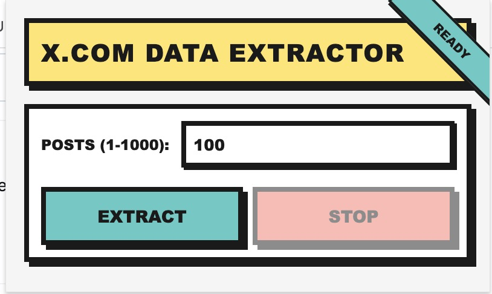
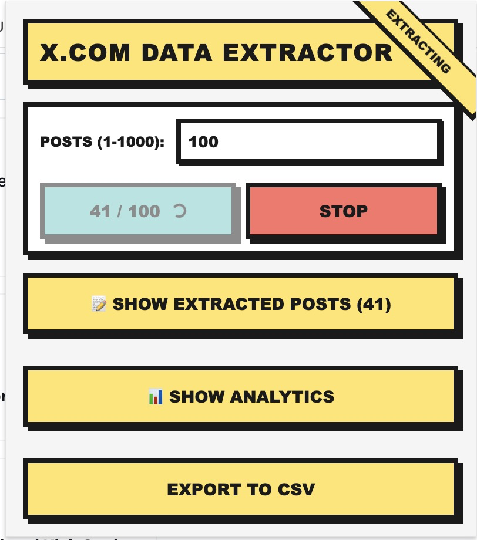

# X.com Data Extractor 📊

[](https://opensource.org/licenses/MIT)
[](https://chrome.google.com/webstore)
[](https://github.com/behnamebrahimi/x-extractor-extension/releases)
[](CONTRIBUTING.md)

> A powerful Chrome extension to extract post data from X.com (formerly Twitter) with advanced analytics, CSV export, and anti-detection features.



## ✨ Features

### 🚀 Core Extraction
- **Mass Data Collection**: Extract up to **1000 posts** in a single session
- **Smart Metadata Capture**: Automatically captures author, text, timestamps, engagement metrics, and media URLs
- **Flexible Targeting**: Works on any X.com page (timelines, profiles, search results, hashtags)
- **Real-time Progress**: Live progress tracking with current/total counters

### 🤖 Anti-Detection Technology
- **Human-like Scrolling**: Randomized scroll patterns with natural delays (500-2000ms)
- **Scroll Jitter**: Variable scroll distances (200-500px) with random offsets
- **Smooth Animation**: Easing functions for natural scroll behavior
- **Rate Limiting Protection**: Exponential backoff for 429/403 errors
- **Smart Throttling**: Random delays (1000-3000ms) between data requests
- **Strategic Pauses**: Long breaks every 50 posts to avoid detection
- **Viewport Simulation**: Realistic scroll amounts based on visible content

### 📊 Analytics Dashboard
- **Time of Day Analysis**: 24-hour chart showing posting patterns
- **Weekly Patterns**: Day-of-week breakdown with peak day detection
- **Peak Time Detection**: Automatically identifies your most active hours and days
- **Date Range Filters**: Analyze Last 7/30/90 days or All Time
- **Interactive Charts**: Hover tooltips with counts and percentages
- **Percentage Breakdown**: See distribution of posts across time periods

### 💾 Export & Data Management
- **CSV Export**: Download all extracted data in spreadsheet format
- **Complete Metadata**: Includes all engagement metrics and media URLs
- **ISO 8601 Timestamps**: Standardized, parseable date formats
- **Instant Download**: One-click export with timestamped filenames

### 🎨 Design
- **Neobrutalism UI**: Bold, modern interface with high contrast
- **Responsive Design**: Works perfectly on all screen sizes
- **Smooth Animations**: Polished transitions and interactions
- **Accessibility**: WCAG AA compliant colors and keyboard navigation

## 🎥 Demo


*Extract posts with real-time progress tracking*


*Visualize your posting patterns with interactive charts*

## 📋 Table of Contents

- [Installation](#-installation)
- [Usage](#-usage)
- [Features in Detail](#-features-in-detail)
- [Configuration](#-configuration)
- [Development](#-development)
- [Contributing](#-contributing)
- [License](#-license)
- [Support](#-support)

## 🚀 Installation

### Prerequisites

- **Google Chrome** or **Microsoft Edge** (version 90+)
- **Node.js** (version 16+) - Only for development
- **npm** or **bun** - Only for development

### For Users (Pre-built Extension)

1. Download the latest release from [Releases](https://github.com/behnamebrahimi/x-extractor-extension/releases)
2. Unzip the downloaded file
3. Open Chrome and navigate to `chrome://extensions/`
4. Enable "Developer mode" (toggle in top-right)
5. Click "Load unpacked" and select the `dist` folder
6. The extension icon will appear in your toolbar

### For Developers (Build from Source)

```bash
# Clone the repository
git clone https://github.com/behnamebrahimi/x-extractor-extension.git
cd x-extractor-extension

# Install dependencies
npm install
# or
bun install

# Build the extension
npm run build
# or
bun run build

# Load the dist/ folder in Chrome as described above
```

### Verification

After installation, you should see the X.com Data Extractor icon in your Chrome toolbar. Click it while on X.com to verify it's working.

## 📖 Usage

### Basic Extraction

1. **Navigate to X.com**: Open any page with posts (timeline, profile, search, etc.)
2. **Open Extension**: Click the extension icon in your toolbar
3. **Set Limit**: Choose how many posts to extract (1-1000)
4. **Start Extraction**: Click "Start Extraction" button
5. **Wait for Completion**: The extension will automatically scroll and collect posts
6. **View Results**: Extracted posts appear in the preview section

### Analytics Dashboard

After extracting posts:

1. Click **"📊 Show Analytics"** button
2. View your **peak posting times** in the summary cards
3. Explore the **Time of Day** chart to see hourly patterns
4. Check the **Day of Week** chart for weekly trends
5. Use the **date range filter** to focus on specific periods

### Exporting Data

1. Click **"Export to CSV"** button at the bottom
2. File downloads automatically as `x-posts-YYYY-MM-DD-HHmmss.csv`
3. Open in Excel, Google Sheets, or any CSV-compatible tool

### Advanced Usage

#### Custom Extraction Strategies

```javascript
// For long threads: Start from the top and extract down
// For user profiles: Extract from their timeline
// For search results: Use specific keywords or hashtags
// For trending topics: Navigate to Explore page
```

#### Best Practices

- **Start small**: Test with 50-100 posts first
- **Respect rate limits**: Wait 10-15 minutes between large extractions
- **Off-peak hours**: Extract during low-traffic times for better success
- **Incognito mode**: Consider using incognito to avoid profile-based rate limits
- **Regular exports**: Save data frequently to avoid losing progress

## 🔧 Configuration

### Extraction Settings

| Setting | Range | Default | Description |
|---------|-------|---------|-------------|
| Post Limit | 1-1000 | 100 | Maximum posts to extract |
| Timeout | N/A | 30 min | Maximum extraction duration |
| Scroll Delay | 500-2000ms | Random | Time between scrolls |
| Request Delay | 1000-3000ms | Random | Time between post processing |
| Pause Threshold | N/A | 50 posts | Posts before long pause |

### Analytics Settings

| Filter | Options | Description |
|--------|---------|-------------|
| Date Range | 7/30/90 days, All Time | Filter posts by date |
| Chart Type | Bar (default) | Visualization type |
| Peak Detection | Auto | Highlights peak times |

## 🛠️ Development

### Project Structure

```
x-extractor-extension/
├── src/
│   ├── components/          # React components
│   │   ├── AnalyticsDashboard.jsx
│   │   ├── TimeOfDayChart.jsx
│   │   ├── DayOfWeekChart.jsx
│   │   ├── ExtractorPanel.jsx
│   │   ├── PostPreview.jsx
│   │   └── ExportButton.jsx
│   ├── content/             # Content scripts
│   │   └── content-script.js
│   ├── background/          # Background scripts
│   │   └── service-worker.js
│   ├── popup/               # Extension popup
│   │   ├── App.jsx
│   │   ├── main.jsx
│   │   └── index.html
│   ├── utils/               # Utility functions
│   │   ├── extractor.js
│   │   ├── csvExporter.js
│   │   ├── timeAggregation.js
│   │   └── logger.js
│   ├── styles/              # Stylesheets
│   │   └── neobrutalism.css
│   └── __tests__/           # Unit tests
├── public/                  # Static assets
│   └── icons/
├── dist/                    # Built extension (generated)
├── manifest.json            # Extension manifest
├── vite.config.js           # Build configuration
└── package.json             # Dependencies
```

### Available Scripts

```bash
# Development build with watch mode
npm run dev

# Production build
npm run build

# Run tests
npm test

# Run tests in watch mode
npm test:watch
```

### Tech Stack

- **Framework**: React 18.2.0
- **Build Tool**: Vite 5.0.0
- **Charts**: Chart.js 4.4.8
- **Testing**: Vitest 1.0.0
- **Extension API**: Chrome Manifest V3

### Adding New Features

1. Create feature branch: `git checkout -b feature/my-feature`
2. Make your changes in `src/`
3. Add tests in `src/__tests__/`
4. Run tests: `npm test`
5. Build extension: `npm run build`
6. Test in Chrome
7. Commit and push: `git commit -am "Add feature" && git push`
8. Create Pull Request

## 🤝 Contributing

We welcome contributions! Please see our [Contributing Guide](CONTRIBUTING.md) for details.

### Quick Start for Contributors

1. Fork the repository
2. Clone your fork: `git clone https://github.com/YOUR_USERNAME/x-extractor-extension.git`
3. Create a branch: `git checkout -b feature/amazing-feature`
4. Make your changes and add tests
5. Run tests: `npm test`
6. Commit: `git commit -m "Add amazing feature"`
7. Push: `git push origin feature/amazing-feature`
8. Open a Pull Request

### Code Style

- Follow existing code conventions
- Use meaningful variable names
- Add comments for complex logic
- Write tests for new features
- Keep functions small and focused

## 📊 Roadmap

- [ ] **v1.1**: Export to JSON and PDF formats
- [ ] **v1.2**: Heatmap visualization (hour × day grid)
- [ ] **v1.3**: Advanced filtering (by engagement, media type, etc.)
- [ ] **v1.4**: Sentiment analysis integration
- [ ] **v1.5**: Scheduling and automation features
- [ ] **v2.0**: Firefox and Safari support

## 🐛 Known Issues

- Large extractions (800+ posts) may timeout on slow connections
- Some promoted tweets may not be captured correctly
- Rate limits vary by account type and activity

See [Issues](https://github.com/behnamebrahimi/x-extractor-extension/issues) for full list.

## 📄 License

This project is licensed under the MIT License - see the [LICENSE](LICENSE) file for details.

## 🙏 Acknowledgments

- [Chart.js](https://www.chartjs.org/) for beautiful charts
- [React](https://react.dev/) for the UI framework
- [Vite](https://vitejs.dev/) for lightning-fast builds
- The open-source community for inspiration and tools

## 📧 Support

- **Issues**: [GitHub Issues](https://github.com/behnamebrahimi/x-extractor-extension/issues)
- **Discussions**: [GitHub Discussions](https://github.com/behnamebrahimi/x-extractor-extension/discussions)
- **Email**: support@example.com

## ⭐ Star Us!

If you find this project useful, please consider giving it a star on GitHub! It helps others discover the project and motivates us to keep improving it.

## 🔗 Related Projects

- [Twitter API](https://developer.twitter.com/) - Official Twitter API
- [twint](https://github.com/twintproject/twint) - Twitter scraping tool
- [Social Analyzer](https://github.com/qeeqbox/social-analyzer) - Social media analysis

---

**Made with ❤️ by [Behnam Ebrahimi](https://github.com/behnamebrahimi)**

**⚠️ Disclaimer**: This tool is for educational and research purposes. Use responsibly and respect X.com's Terms of Service and rate limits.
